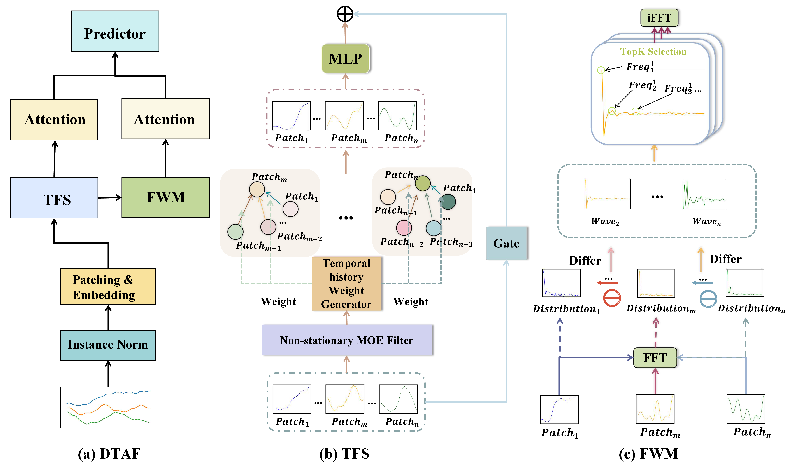
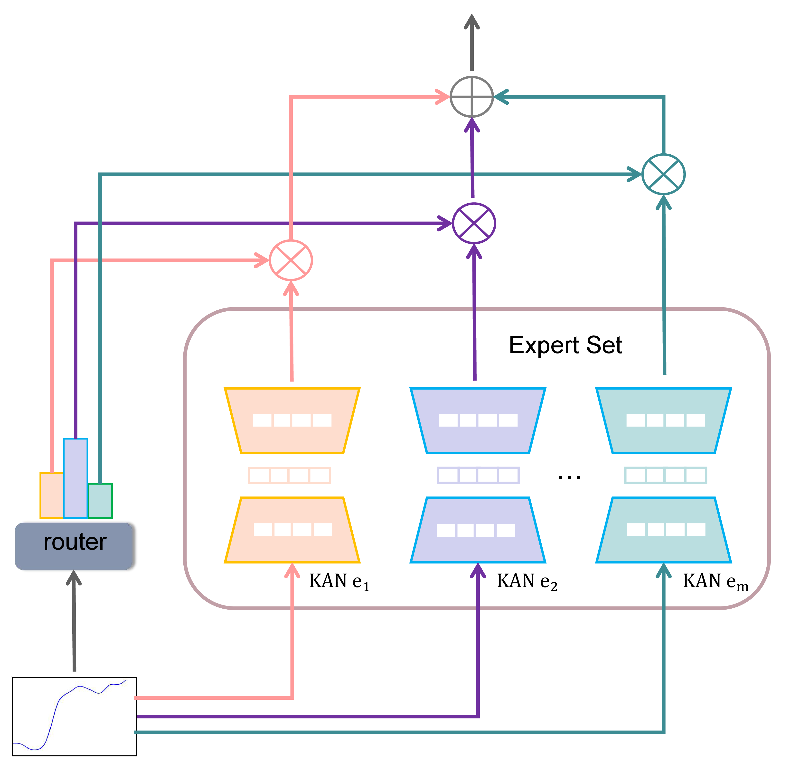
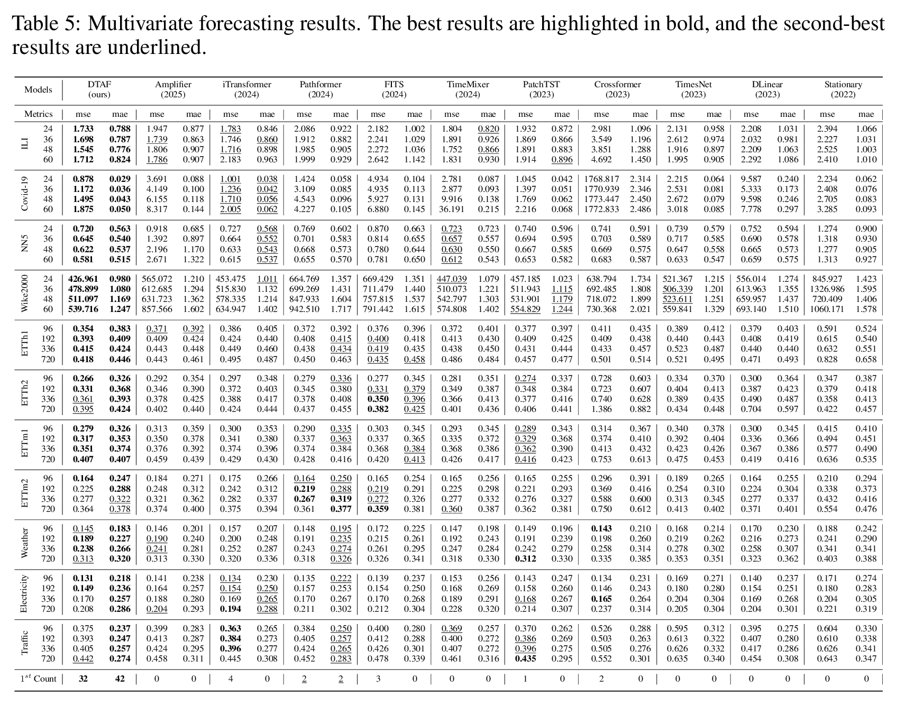

#  Towards Non-Stationary Time Series Forecasting with Temporal Stabilization and Frequency Differencing

 [](https://www.python.org/)  [](https://pytorch.org/)

This code is the official PyTorch implementation of our paper: Towards Non-Stationary Time Series Forecasting with Temporal Fusion and Frequency Differencing.


## Introduction

***DTAF***, a dual-branch framework that addresses non-stationarity in both the temporal and frequency domains. For the temporal domain, the ***Temporal Stabilizing Fusion*** (TFS) module employs a non-stationary mix of experts (MOE) filter to disentangle and suppress temporal non-stationary patterns while preserving long-term dependencies. For the frequency domain, the ***Frequency Wave Modeling*** (FWM) module applies frequency differencing to dynamically highlight components with significant spectral shifts. By fusing the complementary outputs of TFS and FWM, DTAF generates robust forecasts that adapt to both temporal and frequency domain non-stationarity.  



The Non-stationary MOE Filter: 

<div align="center">

</div>

## Quickstart
1. Requirements

Install the dependencies with the following command:

```shell
pip install -r requirements.txt
```

2. Data preparation

You can obtain the well-preprocessed datasets from [Google Drive](https://drive.google.com/file/d/1vgpOmAygokoUt235piWKUjfwao6KwLv7/view?usp=drive_link) or [Baidu Drive](https://pan.baidu.com/s/1ycq7ufOD2eFOjDkjr0BfSg?pwd=bpry). Then, place the downloaded data under the folder `./dataset`. 

3. Train and evaluate the model

- To see the model structure of DTAF,  [click here](./ts_benchmark/baselines/dtaf/model/DTAF_model.py).
- We provide all the experiment scripts for DTAF and other baselines under the folder `./scripts/multivariate_forecast`.  

## Results
We utilize the Time Series Forecasting Benchmark ([TFB](https://github.com/decisionintelligence/TFB)) code repository as a unified evaluation framework, providing access to **all baseline codes, scripts, and results**. Following the settings in TFB, we do not apply the **"Drop Last"** trick to ensure a fair comparison.


### Results of comprehensive parameter searches
Results from **comprehensive parameter searches** for the long-term forecasting task. The look-back window underwent testing with lengths **36 and 104** for NN5, ILI, Covid-19, and Wike2000, and **96, 336, and 512** for all other datasets. **We search for the best results from these look-back windows and report the best results.**

Extensive experiments on 11 real-world datasets from 6 different application domains demonstrate that DTAF achieves state-of-the-art(SOTA) performance. We show the full main results of the 11 below:

<div align="center">

</div>
